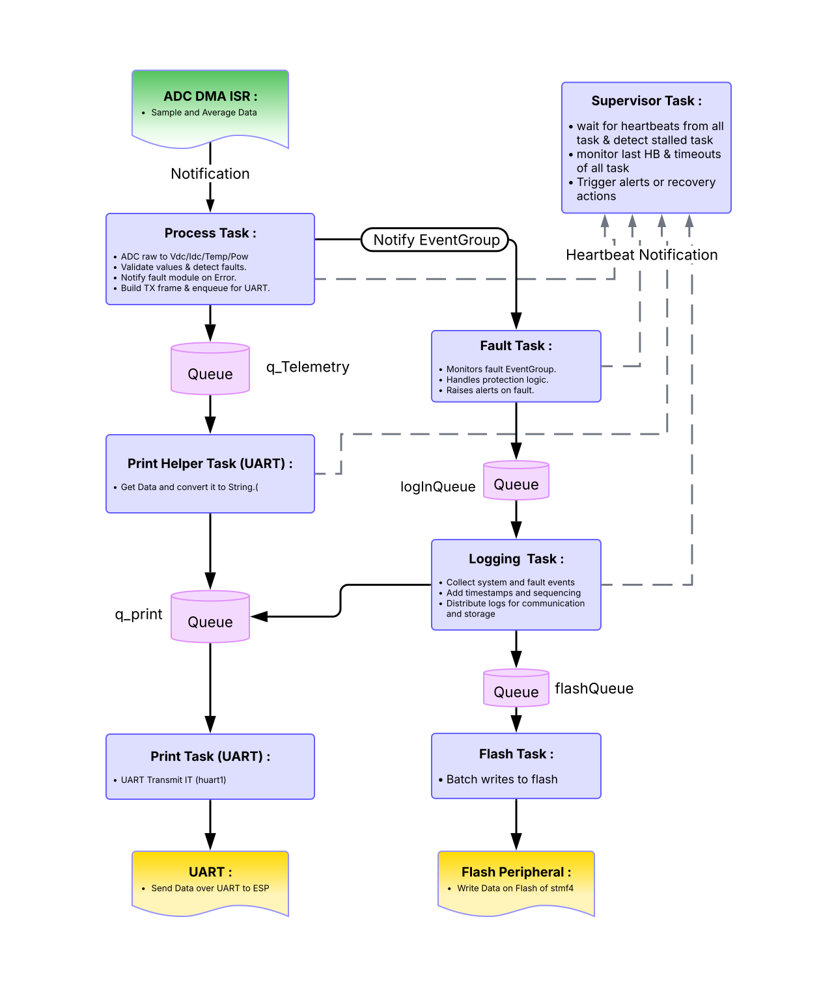
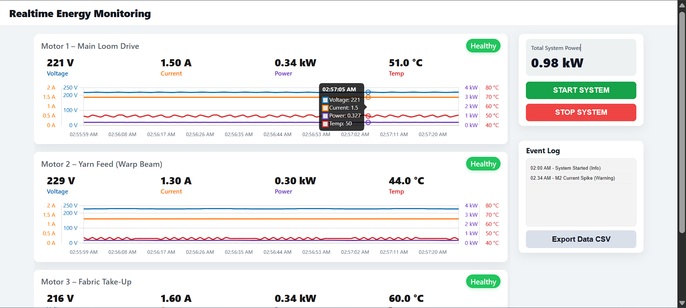
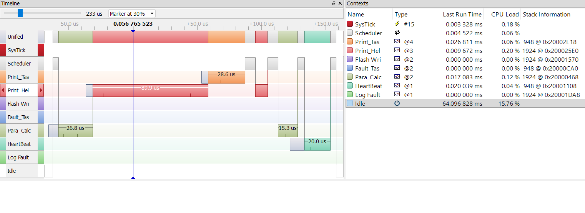

# RTOS-Based Edge Monitoring System for Industrial Machines ⚡

This project is an RTOS-based monitoring system for a 3-motor industrial machine e.g. shuttleless weaving loom.

-   STM32F4 running FreeRTOS collects motor electrical and temperature data, processes it in real time, detects faults, and logs important events.
-   ESP32 gets data via UART, which hosts a local web dashboard to display live machine and motor health information.

The system is non-intrusive and retrofit-friendly, meaning it can be added to existing machines without changing their control logic. It is designed for monitoring and diagnostics, not for controlling the machine (basic ON/OFF is given).

---

## ⚡ Why This Project?

This is a production-style edge monitoring system, not a simple demo or data logger.

-   **RTOS-first design**
    Independent tasks for acquisition, processing, faults, logging, and communication ensure deterministic behavior.

-   **Predictable real-time performance**
    DMA-driven ADC and bounded task execution deliver low jitter under continuous load.

-   **Robust fault handling**
    Cycle-bounded fault detection with watchdogs, CRC, and non-blocking logging for safe failure handling.

-   **Scalable architecture**
    Queue-based pipelines allow adding sensors or machines without redesign.

-   **Edge-focused system design**
    Time-critical logic runs on STM32; ESP32 is used only for visualization.

This project reflects **real RTOS design principles used in industrial embedded systems**.

---

## ⚡ System Architecture

> The diagram shows task separation, ISR handoff, queues, fault handling, logging, and supervision flow on the STM32.

---

## ⚡ Tech Stack

-   **MCU 1 (STM32F446RE, Nucleo)**

    -   FreeRTOS for task scheduling
    -   ADC with DMA for fast sampling
    -   Processing tasks for Vdc, Idc, Power, Temp x3
    -   UART Tx for inter-MCU comms

-   **MCU 2 (ESP32)**

    -   UART Rx + packet parsing
    -   Async WebSocket Server
    -   Data pushed to Web Dashboard

-   **Frontend**
    -   Chart.js for real-time graphs
    -   HTML/CSS/JS for clean UI

---

## ⚡ Fault Detection & Logging

The system detects and logs:

-   Over-voltage / Under-voltage
-   Over-current
-   Over-temperature
-   Under-power / abnormal load

Each fault is:

-   Detected locally at the edge
-   Timestamped
-   Logged to flash
-   Forwarded to the ESP32 dashboard

Logging is non-blocking and designed to avoid priority inversion.

---

## ⚡ Performance Characteristics

| Metric                     | Value                   |
| -------------------------- | ----------------------- |
| Parameters monitored       | 12 (V/I/P/T × 3 motors) |
| ADC throughput             | >10 kSamples/sec        |
| Fault detection latency    | <10 ms                  |
| Telemetry update rate      | 1-5 Hz                  |
| End-to-end latency         | <100 ms (typical)       |
| Communication path latency | <50 ms                  |
| Logged events              | >1000                   |
| CPU utilization reduction  | ~30%                    |

<!-- | Task scheduling jitter     | <150 µs                        | -->

---

## ⚡ Demo

**Live Web Dashboard (ESP32):**

> Real-time visualization of 3-motor machine telemetry (V/I/P/T), fault status, and system health streamed from the STM32 edge node.

**RTOS Task Execution Trace (SEGGER SystemView):**

> FreeRTOS task scheduling, ISR activity, and inter-task communication showing bounded execution time and deterministic behavior under load.
